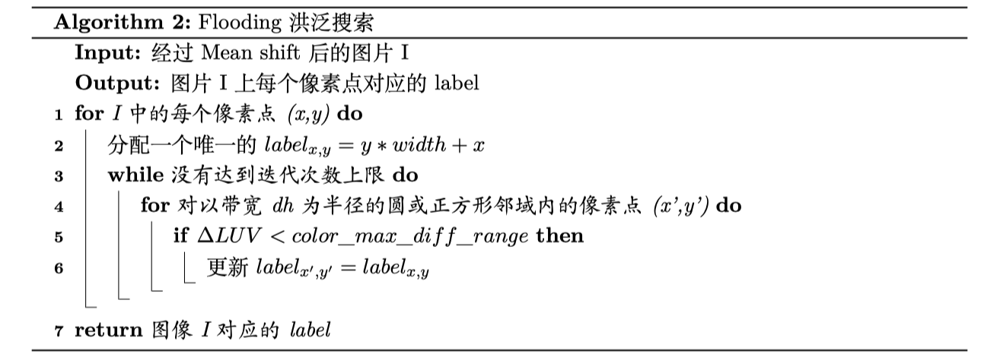
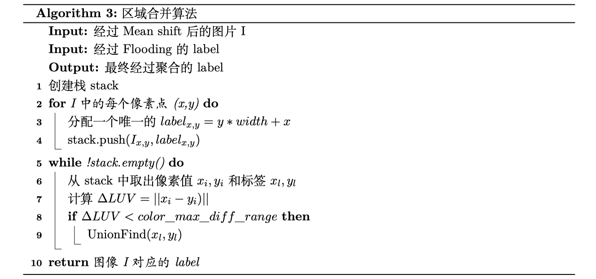

# CUDA-Meanshift-segmentation

## Environment
在以下环境中通过测试
```
gcc-5.5.0, CUDA 9.0
```

## Bundled Libraries
```
cimg-2.6.4
eigen-3.3.7
spdlog-1.3.1
```

## Run main module
我们设计了两个测试程序, `main_image`和`main_camera`, `main_image`读取一个测试图像并进行处理, 
`main_camera`实时读取摄像头的数据, 并进行实时处理

*注意:* `main_camera`模块依赖于opencv库, 请确保您的平台上有安装

## Run test module
先编译整个项目
```bash
cmake ..
make all
```
编译完成后所有可执行文件位于`<项目根目录>/build/bin`\
所有动态链接库位于`<项目根目录>/build/lib`

#### 测试可执行文件使用方法
`/test`文件夹下每个文件编译后都会生成一个可执行程序:
> `meanshift_filter_gen` 单线程生成meanshift滤波结果的程序 \
> `meanshift_filter_cmp` 比较meanshift待测试结果和参考结果的程序 \
> `union_find_gen` 单线程生成union find结果的程序 \
> `union_find_cmp` 比较union find待测试结果和参考结果的程序

#### 测试脚本使用方法
在**项目根目录**下执行
```bash
scripts/test_union_find.sh <test_path> && scripts/test_meanshift.sh <test_path2>
```
其中`test_path`和`test_path2`文件夹应包含待测试模块的输出bin文件, 您需要测试的应模块读取data文件夹下各个模块的输入数据, 然后用相同文件名输出到:
```bash
test_path/1.bin
test_path/2.bin
...
```

您可以使用以下测试模块输出待测试数据:
> meanshift_filter模块的测试程序为`cuda_ms_filter_test` \
> flooding模块的测试程序为`cuda_flooding_test` \
> union find模块(CUDA版本)的测试程序为`cuda_union_find_test` \
> union find模块(Pthread版本)的测试程序为`pth_union_find_test`

## Example

使用`main_image`模块的样例输出。


#### Implementation details



